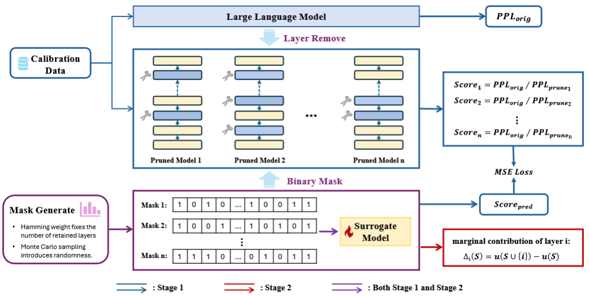

# Pruning as a Cooperative Game: Surrogate-Assisted Layer Contribution Estimation for Large Language Models



* We rethink LLM pruning from a game-theoretic perspective, treating layers as interdependent players and revealing inter-layer dependencies that static heuristics fail to capture.
* We propose a scalable approximation framework that leverages stratified Monte Carlo mask sampling and a lightweight surrogate network, enabling efficient Shapley-based estimation of layer contributions in large LLMs.
* We validate our method on language modeling tasks and zero-shot benchmarks, showing consistent improvements over strong pruning baselines across diverse architectures.


## Installation
  ```bash
  conda create -n Shapley python=3.12
  conda activate Shapley
  pip install -r requirement.txt
  ```


